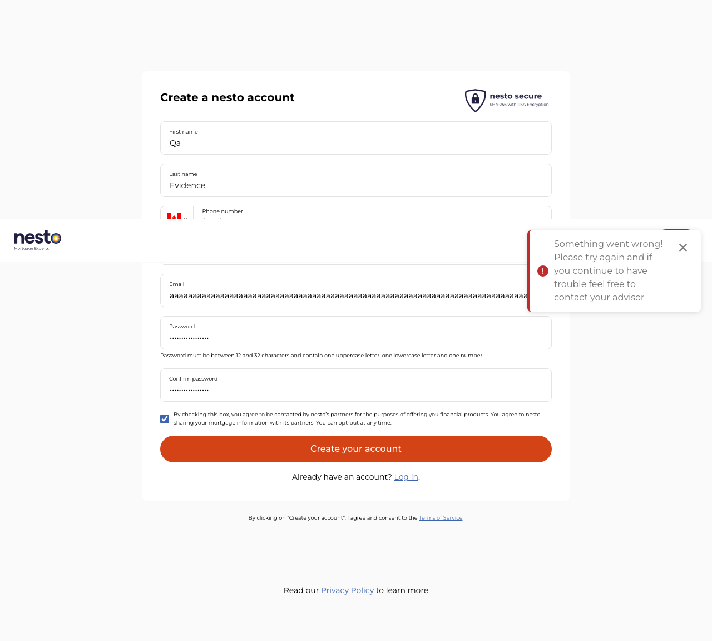

# Signup bug report

Observed against the QA signup application on 2026-09-23. No production target was contacted.

## BUG-SIGNUP-001 — French phone-country control has an English accessible name

- **Severity:** Low
- **Status:** Open, product and language-owner review requested
- **Scope:** `/fr/signup`
- **Observed:** The visible French form exposes the phone-country selector with an English accessible name. The test uses the stable form name fallback because the French expected-copy baseline cannot truthfully supply a translated label.
- **Expected:** Controls on the French signup page should expose an approved French accessible name.
- **Impact:** A French screen-reader user encounters mixed-language control naming.

Read-only DOM inspection of the French page produced these relevant attributes:

```html
<select name="phoneCountry" aria-label="Phone number country">
  …
</select>
```

The control has no associated `<label>`, `aria-labelledby`, or `title`. Its accessible name therefore comes directly from the English `aria-label`. A corrected implementation should use approved French text, preferably through the same localization source as the visible French form.

## BUG-SIGNUP-002 — Signup sends an email exceeding standard length limits to the account API

- **Severity:** Medium
- **Status:** Open, reproducible in the automated matrix
- **Scope:** English and French signup in Chromium, Firefox, and WebKit
- **Observed:** A 260-character local part plus `@qa.nesto.ca` passed client-side validation and attempted `POST */accounts` in all six browser/locale combinations.
- **Expected:** The UI should reject an email beyond the supported account-service limit and show accessible feedback before sending an account-creation request.
- **Safety control:** Automation intercepted and aborted all six requests. No account was created by this case.
- **Regression test:** `SGN-016/email-exceeds-standard-length` is marked as an expected failure. A product fix produces an unexpected pass so the issue and baseline must be reviewed.
- **Visual evidence:** The screenshot and video use synthetic data. Their account request was intercepted before it left the browser.



[Watch the excessive-length email reproduction video](evidence/bug-signup-002-email-length-limit.webm)

The visual evidence shows the entered boundary value and resulting generic error. The Playwright request interception is the evidence that the form attempted `POST */accounts`; a screenshot alone cannot prove that network behavior.

## Investigation note — pre-hydration form submission

During bounded SGN-006 investigation, interacting before client hydration could trigger native GET submission and reset the form. The guarded workflow now waits for hydration. This remains an investigation note because it was observed under fast automation and has not been confirmed as a user-reproducible defect.

## BUG-SECURITY-001 — Signup pages do not return a Content Security Policy header

- **Severity:** Medium security finding
- **Confidence:** High, as reported by OWASP ZAP rule `10038`
- **Status:** Open, security and application-owner triage requested
- **Scope:** English `/signup` and French `/fr/signup`
- **Observed:** Bounded unauthenticated passive scans reported that both signup responses lacked a Content Security Policy header.
- **Expected:** The application owner should define and deploy an appropriate CSP, or document why another control or a time-bound exception is acceptable.
- **Impact:** Without CSP, the browser lacks this additional restriction on which scripts, styles, frames, and other resources the page may load. This finding does not by itself demonstrate an exploitable cross-site scripting vulnerability.
- **Safety:** Each scan made one reported `GET` request to its exact approved signup URL. Form processing and active scanning were disabled; no account was created.
- **Evidence:** [English sanitized ZAP report](security-report/en-CA/index.html) and [French sanitized ZAP report](security-report/fr-CA/index.html).

ZAP also classified each page as a “Modern Web Application” with informational risk. That is descriptive scanner metadata and is not recorded as a product bug.

## Not reported as product bugs

- `example.com` addresses returned HTTP 422 with a placeholder-email explanation; this is treated as intentional validation.
- The final SGN-006 response contained a populated sensitive-shaped optional field. The privacy guard intentionally did not retain its name or value, so ownership review is required before classifying it as a defect.
- Axe-core reported zero WCAG A/AA violation rules in the initial-page baseline. Manual accessibility and readability review remain incomplete.

## Evidence policy

Only synthetic read-only reproductions may be committed. Evidence from write-capable account creation remains disabled because it could contain passwords, tokens, account identifiers, or response data. Screenshots and videos supplement the automated assertion and request evidence; they do not replace it.
